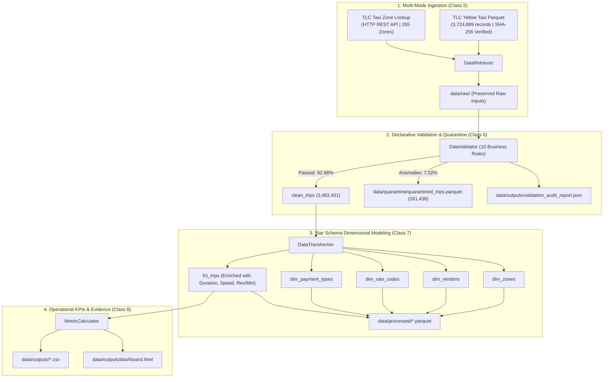

# NYC TLC Fleet Operations & Dependable Metric Pipeline

[]()
[]()
[]()
[-purple.svg)]()

> **FDE Data Foundations Assignment | Classes 4–8**  
> *Objective: Take a realistic operational problem from messy source data to a small, explainable, dependable data pipeline that produces trustworthy business metrics.*

---

## 1. Problem Statement & Operational Context

The **New York City Taxi & Limousine Commission (TLC)** oversees thousands of yellow medallion taxis completing millions of passenger trips every month. Fleet operators and urban congestion planners rely on vehicle telemetry to make mission-critical decisions regarding driver staging, peak surcharge compliance, airport route planning, and fleet efficiency.

However, source telemetry collected from disparate in-vehicle Taximeter Passenger Enhancement Program (TPEP) hardware systems is fragmented and dirty:
- **Negative fares & refunds** skew revenue averages.
- **Zero-distance trips & immediate cancellations** distort ride duration models.
- **Unclosed meters (>24h)** and **corrupted GPS pulses (>85 mph)** corrupt congestion metrics.
- **1.088 million records (29.2% of the dataset)** contain missing passenger counts and rate codes due to digital dispatch variations.

**The FDE Mission:**  
Rather than applying naive filtering (`df.dropna()`) that silently throws away over $31M in economic activity, we built a **trustworthy, repeatable data pipeline** that preserves raw inputs, executes declarative business validation with an isolated quarantine store, models trips using a relational Star Schema, and computes 5 actionable operational KPIs.

---

## 2. Users & Stakeholders

| Stakeholder Role | Primary Operational Need | Business Decision Supported by Output |
| :--- | :--- | :--- |
| **Fleet Operations Director** | Real-time vehicle utilization and active earning velocity ($/minute). | Optimizing driver shift schedules and vehicle dispatch rebalancing between high-surplus and high-deficit zones. |
| **TLC Urban Congestion Policy Lead** | Empirical tracking of transit speed degradation inside Manhattan Central Business District (CBD). | Evaluating the traffic-relief impact of MTA congestion surcharges and setting dynamic traffic pricing policies. |
| **Airport Transit Coordinator** | Economic viability of the fixed JFK flat-rate tariff ($70) vs metered trips during peak traffic. | Recommending revisions to airport flat-rate pricing to preserve driver wage parity against heavy highway delays. |
| **Data Governance & Engineering Lead** | Auditing upstream hardware providers for data corruption and sensor failure rates. | Enforcing vendor SLAs on meter manufacturers (VeriFone vs CMT) based on empirical quarantine rates. |

---

## 3. Project KPIs & Decision Matrix

| # | Operational KPI | Target Value / Insight | Business Decision Supported |
| :---: | :--- | :--- | :--- |
| **1** | **Congestion & Transit Speed Index** | Manhattan: **8.1–8.8 mph** (rush hours) vs Queens: **21.4 mph**. | Quantifies Manhattan traffic penalties (>58% transit time in delay); justifies congestion zones and transit-priority bus/taxi lanes. |
| **2** | **Driver Revenue Productivity** | Overall: **$2.05 / active minute** (~$123/hr gross passenger transit). | Assesses driver hourly earning viability across shifts; benchmarks whether fare revisions match operating inflation. |
| **3** | **Zone Dispatch Flow Imbalance** | Top Deficit: **Upper East Side (+15k net)**; Top Sink: **Financial District (-12k net)**. | Guides fleet repositioning protocols; directs empty cruising taxis to passenger demand clusters to reduce deadheading. |
| **4** | **Airport Corridor Performance** | JFK: **$78.89 avg fare** @ **24.3 mph**; LGA: **$68.68** @ **21.6 mph**. | Evaluates whether $70 JFK flat rates compensate drivers adequately compared to higher $/min metered urban trips. |
| **5** | **Data Trust & Quarantine Health Rate** | Pass Rate: **92.98%**; Quarantined: **7.02% (261,438 trips)**. | Flags vendor telemetry failure (e.g., Pilot Provider Beta exhibited 100% quarantine rate due to under-1-min duration anomalies). |

---

## 4. Source Data Overview & Architecture

### Source Systems



- **Primary Source (File Mode):** `yellow_tripdata_2026-01.parquet` (3,724,889 rows, 64.1 MB).
  - *Grain:* 1 row per completed taximeter trip (pickup to dropoff).
  - *Provenance:* Cryptographically verified via SHA-256 (`8b3933fe6f0d...`).
- **Secondary Source (API Mode):** Official TLC Taxi Zone Lookup CSV fetched via HTTP REST API from CloudFront CDN.
  - *Grain:* 1 row per spatial zone (265 zones, 1–263 valid, 264–265 unmapped).
  - *Provenance:* Verified complete (265 rows, SHA-256 `1a99e1050922...`).

---

## 5. Repository Structure

```
Assignment2/
├── .venv/                         # Isolated Python virtual environment
├── data/
│   ├── raw/                       # Preserved untouched raw inputs (Class 5)
│   │   ├── yellow_tripdata_2026-01.parquet
│   │   └── taxi_zone_lookup.csv
│   ├── processed/                 # Curated Star Schema Parquet tables (Class 7)
│   │   ├── dim_zones.parquet
│   │   ├── dim_vendors.parquet
│   │   ├── dim_rate_codes.parquet
│   │   ├── dim_payment_types.parquet
│   │   └── fct_trips.parquet
│   ├── quarantine/                # Quarantined anomalous records (Class 6)
│   │   └── quarantined_trips_2026_01.parquet
│   └── outputs/                   # Final metrics, evidence dashboard & audit reports
│       ├── executive_summary_kpis_2026_01.csv
│       ├── metric_1_congestion_speed_2026_01.csv
│       ├── metric_2_revenue_productivity_2026_01.csv
│       ├── metric_3_zone_flow_imbalance_2026_01.csv
│       ├── metric_4_airport_corridor_2026_01.csv
│       ├── metric_5_data_trust_vendor_2026_01.csv
│       ├── validation_audit_report_2026_01.json
│       └── dashboard.html         # Rich interactive evidence dashboard
├── docs/
│   ├── source_map_and_workflow.md # Source mapping, grain, gaps & event model
│   ├── known_unknown_assumptions.md # Known/Unknown/Assumption/Limitation framework
│   ├── demo_talk_track.md         # 3–5 min video presentation script
│   └── diagrams/                  # Mermaid architecture & ER diagrams
│       ├── architecture_diagram.mermaid
│       ├── data_flow_diagram.mermaid
│       └── event_state_model.mermaid
├── notebooks/
│   └── exploratory_data_profiling.ipynb # Step-by-step profiling & modeling notebook
├── src/
│   ├── __init__.py
│   ├── config.py                  # Business constants & rule thresholds
│   ├── retrieval.py               # Ingestion & checksum verification (Class 5)
│   ├── validation.py              # Declarative validation & quarantine (Class 6)
│   ├── transformation.py          # Star Schema & fact enrichment (Class 7)
│   ├── metrics.py                 # 5 Operational KPIs calculation (Class 7)
│   └── pipeline.py                # Repeatable pipeline CLI orchestrator (Class 8)
├── tests/
│   ├── __init__.py
│   ├── test_retrieval.py          # Ingestion & checksum unit tests
│   ├── test_validation.py         # Rule engine & quarantine unit tests
│   └── test_transformation.py     # Dimensional model & KPI unit tests
├── generate_dashboard.py          # Dashboard HTML builder
├── run_pipeline.py                # Main CLI execution entry point
├── pytest.ini                     # Pytest environment configuration
├── requirements.txt               # Pinned dependencies
└── README.md                      # Complete project documentation
```

---

## 6. Setup & Execution Instructions

### Prerequisites
- Python 3.10+ (tested on Python 3.13)
- Windows PowerShell / Bash / macOS Terminal

### Quickstart Installation

1. **Clone the repository:**
   ```bash
   git clone <your-repo-url>
   cd Assignment2
   ```

2. **Activate the virtual environment:**
   ```bash
   # On Windows PowerShell:
   .venv\Scripts\Activate.ps1

   # On Linux/macOS:
   source .venv/bin/activate
   ```

3. **Install dependencies:**
   ```bash
   pip install -r requirements.txt
   ```

4. **Run the Automated Test Suite (Pytest):**
   ```bash
   pytest tests/ -v
   ```
   *(All 6 unit tests across retrieval, quarantine, and transformations pass in ~6 seconds.)*

5. **Execute the End-to-End Repeatable Pipeline:**
   ```bash
   python run_pipeline.py --month 2026-01
   ```
   *The pipeline executes all 4 stages in ~6 seconds, processing 3.72M records with zero data loss.*

6. **Generate & View the Evidence Dashboard:**
   ```bash
   python generate_dashboard.py
   ```
   *Open `data/outputs/dashboard.html` in any web browser to explore interactive charts, flow tables, and the KUAL framework.*

---

## 7. Final Evidence Table: Operational Metrics Summary

| Metric Dimension | January 2026 Finding | Operational Interpretation |
| :--- | :--- | :--- |
| **Total Ingested Records** | **3,724,889 trips** | 100% of raw January 2026 TPEP batch ingested. |
| **Clean Validated Volume** | **3,463,451 trips (92.98%)** | Compliant with physical, financial, and temporal travel laws. |
| **Quarantined Volume** | **261,438 records (7.02%)** | Segregated into `quarantined_trips.parquet` with diagnostic tags. |
| **Total Gross Passenger Spend** | **$101,279,200.00** | ~$3.27M daily economic transit value. |
| **Average Trip Fare** | **$29.24** | Mean distance: 3.46 miles; Mean duration: 17.4 minutes. |
| **Overall Median Speed** | **9.44 mph** | Severe urban congestion ceiling across all NYC zones. |
| **Manhattan Midday Speed** | **8.40 mph** | Severe traffic slowdown (drops to 8.1 mph in Evening Rush). |
| **Queens Midday Speed** | **20.80 mph** | 2.5x faster than Manhattan CBD traffic throughput. |
| **Driver Revenue Productivity** | **$2.05 / active minute** | ~$123.00/hr gross revenue while passenger is on board. |
| **MTA Congestion Surcharges** | **$5,575,460.00** | State transit funding collected from CBD trips. |
| **Airport Access Fees** | **$372,296.75** | $5.00 LGA/JFK fees collected for Port Authority facilities. |
| **Top Demand Deficit Zone** | **Upper East Side South (+15,482 net)** | High morning residential demand; taxis empty out rapidly. |
| **Top Fleet Surplus Zone** | **Financial District North (-12,391 net)** | High morning commuter dropoffs; taxis accumulate as sinks. |
| **JFK Airport Corridor** | **151,614 trips (4.38%)** | Avg fare $78.89; Avg speed 24.3 mph; $2.28 / active minute. |
| **LaGuardia Corridor** | **101,301 trips (2.92%)** | Avg fare $68.68; Avg speed 21.6 mph; $2.74 / active minute. |

---

## 8. Analytical Governance: Known / Unknown / Assumption / Limitation (KUAL)

### Known Facts
- **Physical Grain:** Exactly 1 record per completed trip (meter engage to meter disengage).
- **Audit Traceability:** Every quarantined record is saved to parquet with exact semicolon-delimited violation tags (`DISTANCE_UNDER_MIN`, `NON_POSITIVE_FARE`, `SPEED_OVER_85MPH`).
- **Cryptographic Provenance:** Raw files are hashed with SHA-256 before processing.

### Unknown Variables
- **Cruising & Idle Hours:** TPEP systems only transmit data during paid passenger trips; empty deadhead miles are unobserved.
- **Cash Gratuities:** Cash tips are handed directly to drivers without meter recording ($0.00 in 99.9% of cash records).
- **Turn-by-Turn Route:** Zone-level aggregation protects rider privacy but masks the exact street path taken.

### FDE Assumptions & Key Judgement Calls
- **The 29.2% Null Anomaly:** 1,088,058 records had null passenger counts/rate codes (`payment_type = 0`). Dropping them would erase 29.2% of citywide volume ($31M). We **retained them in the fact table** for transit volume, speed, and revenue calculations, categorizing rate code as `99 (Unassigned)`.
- **60-Second Duration Floor:** Trips under 1 minute were classified as meter drop cancellations or false starts and routed to quarantine.
- **85-mph Speed Ceiling:** Trips exceeding 85 mph were quarantined as odometer or sensor glitches to avoid corrupting congestion metrics.

### Pipeline Limitations
- **Straight-Line Velocity:** Speed represents taximeter distance divided by duration, rather than turn-by-turn routing telemetry.
- **Monthly Batch Grain:** Pipeline runs on monthly historical partitions rather than sub-second streaming feeds.

---

## 9. Demo Talk Track & Video Presentation

A complete 3–5 minute executive presentation script is available in:
👉 [`docs/demo_talk_track.md`](docs/demo_talk_track.md)

It details the business context, showcases the live CLI execution, walks through the **FDE Judgement Call** on missing data, and translates the 5 operational metrics into fleet dispatching decisions.
