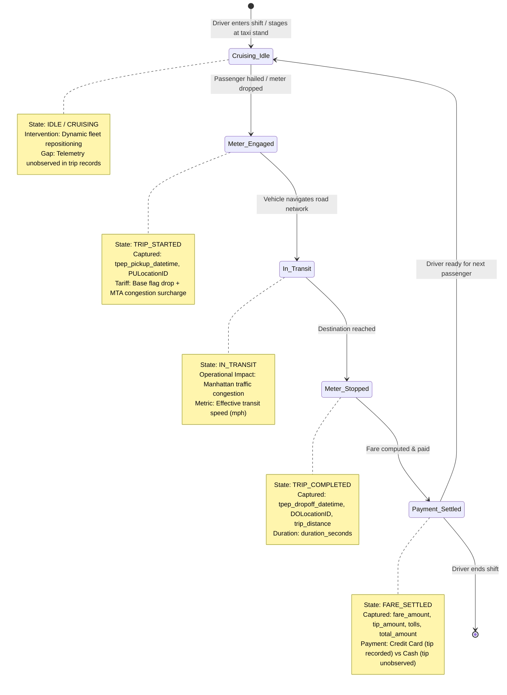

# Source Mapping, Grain, Gaps & Workflow Model

**Project Track:** Track B — NYC Taxi & Limousine Commission (TLC)  
**Target Ingestion Period:** January 2026 (`yellow_tripdata_2026-01.parquet`)  
**Assignment Reference:** Classes 4 & 7 | From Client Data to a Dependable Pipeline  

---

## 1. Business Question to Source Mapping (Class 4)

| Business Question | Required Information | Source System | Source Owner | Data Grain | Gaps / Limitations |
| :--- | :--- | :--- | :--- | :--- | :--- |
| **Q1: Congestion Impact:** How severely does Midtown/CBD traffic reduce taxi transit speeds across rush hours? | Pickup/dropoff timestamps, zone boundaries, trip mileage. | TPEP In-Vehicle Meter Telemetry (Parquet) & TLC Taxi Zone Lookup (CSV) | Technology Service Providers (VeriFone / CMT) & NYC TLC GIS Division | 1 row per completed trip | No turn-by-turn GPS waypoints; speeds represent straight-line/metered transit duration. |
| **Q2: Driver Earnings:** What is the active earning velocity ($/minute) of drivers during in-transit passenger service? | Meter fare, extra charges, congestion surcharges, tip amounts, trip duration. | TPEP Fare Engine & Credit Card Processing Feed | TPEP Meter Vendors & Merchant Acquirers | 1 row per settled fare | Cash tips are not recorded by the meter (omitted from official totals). |
| **Q3: Dispatch Rebalancing:** Which zones suffer severe passenger deficits vs vehicle surpluses? | Aggregated pickup vs dropoff counts by LocationID and time of day. | TPEP In-Vehicle Meter Telemetry & Taxi Zone GIS Table | Fleet Dispatchers / Medallion Management & NYC TLC | Zone x Time Window | Unmet passenger demand (hailed cabs that passed by, canceled hails) is unrecorded. |
| **Q4: Airport Transit Viability:** Does the JFK flat-rate fare ($70) adequately compensate drivers compared to metered trips? | RatecodeID, Airport_fee, tolls, duration, distance, total amount. | TPEP Fare Engine (RateCode 2) & Port Authority Fee Feeds | NYC TLC & Port Authority of NY/NJ | 1 row per airport trip | Flight delays or curbside waiting times before meter engagement are unobserved. |
| **Q5: Data Pipeline Integrity:** Which upstream hardware vendors produce telemetry corruption (negative fares, zero-distance drops)? | VendorID, quality rule violations, quarantine flags. | Ingested TPEP Data Stream & FDE Validation Engine | Hardware Telemetry Vendors (VeriFone, CMT, Pilot Beta) | 1 row per raw record | Hardware calibration logs and firmware versions are not directly included in the feed. |

---

## 2. Source System Ownership & Grain Analysis

### Source 1: NYC TLC Yellow Taxi Trip Records
- **System Owner:** NYC Taxi & Limousine Commission (TLC) in coordination with licensed TPEP vendors (VeriFone Inc., Creative Mobile Technologies).
- **Physical Format:** Apache Parquet (compressed columnar storage, 64.1 MB).
- **Temporal Grain:** Exactly **one record per completed trip** (from meter flag drop to meter disengage).
- **Raw Volume:** 3,724,889 records in January 2026.
- **Key Schema Attributes:**
  - `VendorID`: Hardware provider identifier (1 = CMT, 2 = VeriFone, 6/7 = Pilot Providers).
  - `tpep_pickup_datetime` / `tpep_dropoff_datetime`: UTC/Local meter timestamps.
  - `PULocationID` / `DOLocationID`: TLC Taxi Zone polygon identifiers (1–263).
  - `passenger_count`: Reported passenger count (NULL for app-dispatched / digital records).
  - `trip_distance`: Taximeter odometer distance in miles.
  - `RatecodeID`: Tariff rate applied (1 = Standard, 2 = JFK, 3 = Newark, 4 = Nassau/Westchester, 5 = Negotiated, 6 = Group, 99 = Special).
  - Financials: `fare_amount`, `extra`, `mta_tax`, `tip_amount`, `tolls_amount`, `improvement_surcharge`, `congestion_surcharge`, `Airport_fee`, `cbd_congestion_fee`, `total_amount`.

### Source 2: TLC Taxi Zone Lookup Reference
- **System Owner:** NYC TLC & NYC DoITT (Department of Information Technology and Telecommunications).
- **Physical Format:** CSV served via HTTP REST / CloudFront CDN (`https://d37ci6vzurychx.cloudfront.net/misc/taxi_zone_lookup.csv`).
- **Data Grain:** Exactly **one record per TLC Taxi Zone** (LocationID 1 to 265).
- **Key Attributes:** `LocationID`, `Borough`, `Zone`, `service_zone`.
- **Integrity Validation:** 265 rows, verified against known borough boundaries.

---

## 3. Operational Gaps & Incomplete Information

1. **Cruising & Deadheading Blind Spot:**
   - The data records only passenger-laden trips. Idle cruising time, driver repositioning between trips, and staging wait times at taxi stands or airport lots are unrecorded.
2. **Unfulfilled Demand & Trip Cancellations:**
   - Street-hails that were missed, waved off, or refused are invisible. Immediate cancellations (under 1 minute) appear as zero-distance rides with flag-drop charges.
3. **Cash Tip Gratuities:**
   - TPEP credit card systems accurately capture digital tips (~18–22% average). Cash tips are handed directly to the driver and recorded as $0.00 tip in 99.9% of cash records.
4. **Spatial Resolution (No Turn-by-Turn GPS):**
   - For passenger privacy reasons, exact GPS coordinates were replaced in 2016 by 263 coarse zone polygons. Speeds represent average transit velocity between zone centroids.

---

## 4. Business Workflow State Model (Class 7)

---

## 5. Entities, Interactions, and Policy Interventions

- **Entities:**
  - `Passenger`: Demands transportation, hails vehicle, pays fare and optional gratuity.
  - `Driver / Fleet Operator`: Manages vehicle availability, incurs operating fuel/time costs, receives fare revenue.
  - `TPEP Hardware Provider`: Captures in-vehicle meter telemetry, taximeter pulse distance, and credit card gateway transactions.
  - `Regulator (NYC TLC & MTA)`: Mandates tariffs, collects congestion surcharges ($2.50 / $0.75 CBD fee) and airport access fees ($5.00 LGA/JFK fee).

- **Operational Interventions Supported by Pipeline:**
  1. **Dynamic Staging Allocation:** Directing empty taxis from Surplus Zones (e.g., Financial District morning dropoffs) to Deficit Zones (e.g., Upper East Side residential pickups).
  2. **Congestion Pricing Calibration:** Monitoring whether the CBD congestion surcharge reduces transit delay or increases driver earning efficiency.
  3. **Airport Flat-Rate Review:** Adjusting the fixed JFK flat-rate tariff ($70) when travel times exceed 45 minutes to maintain driver parity with metered rates.
  4. **Vendor SLA Enforcement:** Auditing hardware providers whose meter failure rates exceed acceptable data governance thresholds.
